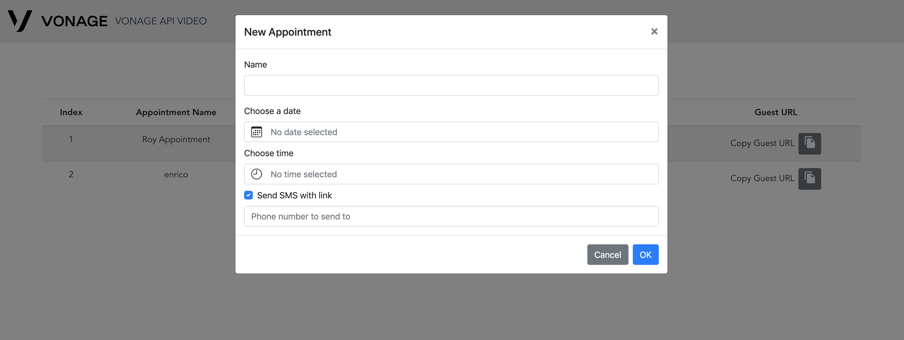

# opentok-secure-appointments

Sample code for building a secure video appointments application

This repository has two parts - a NodeJS Express Server and a Vue Web Application, here you can find per-project information:

1. [Server](./server/README.md)
2. [Web Application](./client/README.md)

_NOTE_: This application is a great starting point for building your solution, and on top of it you should be able able to add your own business logic and features.

## User Story

Assume a healthcare use case of this project, where we would have the following roles:

1. A patient
2. A doctor
3. A clinician.

The clinician would schedule appointments between the doctor and the patient, and provide both of them with appropriate URLs to join a video call.

### Scheduling Appointments

As the clinician, your entry point should be `https://SERVER_ADDRESS/booking` (where SERVER_ADDRESS is where you deployed the Express application). This is the page that allows you to schedule appointments and view the list of previously scheduled appointments.

Upon scheduling an appointment you could also send an SMS with the link to a number, for example, the to the patient. You can also just click 'copy link' form the table of appointments.

Please note that every appointment has two links assigned to it - the HostURL and the GuestURL. In our healthcare use case for instance, the HostURL will be sent to the doctor and the GuestURL will be sent to the patient. You might decide to implement some logic that allows different privileges with each role.

    

### Joining a Video call

After successfully scheduling an appointment, both sides of the call can use the link to join the appointment. We've made it easy to implement a logic that enforces a time frame for the appointment (but you can decide to change it or even omit it using [env variables](./README.md#app-behavior)).

When the time arrives, both parties join the appointment and communicate over Video. We've added the option to mute, unpublish video and share your screen.

    

## Setup

Copy example.env to .env and fill the following variables:

### Messaging API

NEXMO_API_KEY: Retrieve from your [Vonage Communication account](https://dashboard.nexmo.com/sign-in)  
NEXMO_API_SECRET: Retrieve from your [Vonage Communication account](https://dashboard.nexmo.com/sign-in)  
MESSAGING_SMS_FROM: The number you've purchased to send SMS from

### Video API

OPENTOK_API_KEY: Retrieve from your [Vonage Video account](https://www.vonage.com/communications-apis/video/)  
OPENTOK_API_SECRET: Retrieve from your [Vonage Video account](https://www.vonage.com/communications-apis/video/)  
OPENTOK_SESSION_MEDIA_MODE: Session mode- routed or relayed

### App behavior

MINUTES_SESSION_ALLOWED_BEFORE: The amount of time, in minutes, a participant can join the session before it starts  
MINUTES_SESSION_ALLOWED_AFTER: The amount of time, in minutes, a participant can join the session after it starts

### Client variables

VUE_APP_VIDEO_CALL_LOGO_URL: Your logo URL  
VUE_APP_VIDEO_CALL_COMPANY_NAME: Your company name  
VUE_APP_API_SERVER_URL: The development server's URL - Please verify that the port is the one your server is running on! This option is used only in development
VUE_APP_AUDIO_ONLY: Join video session with video unpublished

** Please note that some variables have default values and some are not listed above **

## Local Installation & Deployment

1. Clone the repository and navigate to `opentok-secure-appointments`.

2. Install dependencies: `npm install`.

3. Copy `env.example` to `.env` and edit the environment variables.

4. Run the server and the client app: `npm run start-dev`. This will run both
   the server and the client app.

Open http://localhost:3000/booking in your browser.

## Deploy to Heroku

