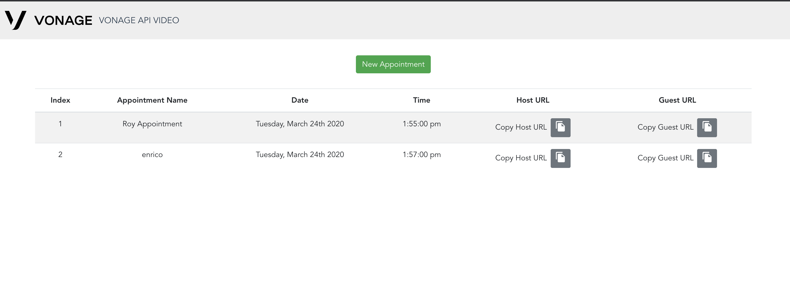

# opentok-appointments-client

### App.vue

App.vue is the parent component. It handles the main template: Header and Router view component.

```javascript
<template>
  <div id="app">
    <Header :companyName="companyName" :logo="logo" />
    <router-view></router-view>
  </div>
</template>
```

### Header

The header component is a simple toolbar with a logo and company name. It's fully customizable by the developer.

To edit the logo and company name, you need to edit `.env` file variables:

```
VUE_APP_VIDEO_CALL_LOGO_URL=
VUE_APP_VIDEO_CALL_COMPANY_NAME=
```

Note: Logo has to be a public URL.

### Routes

The routes are defined in `main.js` file:

```
const routes = [
	{ path: '/booking', component: Booking },
	{ path: '/video', component: VideoCall, query: { token: '' } },
	{ path: '*', redirect: '/not-valid-token' }
];
```

There are two main routes:

- `booking`: from this page, you can create appointments and check the list of available appointments.
- `/video`: given a token URL, it will check if the URL is valid. If so, you will display the videocall page, otherwise you will see an appropriate error message.

### VideoCall

The videocall component handles the logic of the application. On the `mounted` hook, it calls the `{serverUrl}/token` endpoint.
The `{serverUrl}/token` endpoint check the date of the appointment. If the date is within the date range, the server will send back the credentials to join the videocall. If not, the server will send back an errorCode based on the case.

```javascript
<template>
  <div class="video-conference-container">
    <waiting-room v-if="showWaitingRoom" :state="waitingRoomState" />
    <call v-else-if="showVideoCall"
        :apiKey="apiKey"
        :sessionId="sessionId"
        :token="token"
    >
    </call>
    <div v-else class="loading-container">
        <div class="spinner-border" role="status" style="width: 3rem; height: 3rem;">
            <span class="sr-only">Loading...</span>
        </div>
    </div>
  </div>
</template>
```

Based on the server response, the `videocall` component will show either the `waiting-room` component or the `call` component.


### Booking

The booking page handles the creation of new booking. You can select name of the appointment, date and time. You can also send the URLs via SMS using the send SMS button:


You can see the list of appointments:



## Customize UI

To edit the logo and company name, you need to edit `.env` file variables:

```
VUE_APP_VIDEO_CALL_LOGO_URL=
VUE_APP_VIDEO_CALL_COMPANY_NAME=
```

Note: Logo has to be a public URL.
